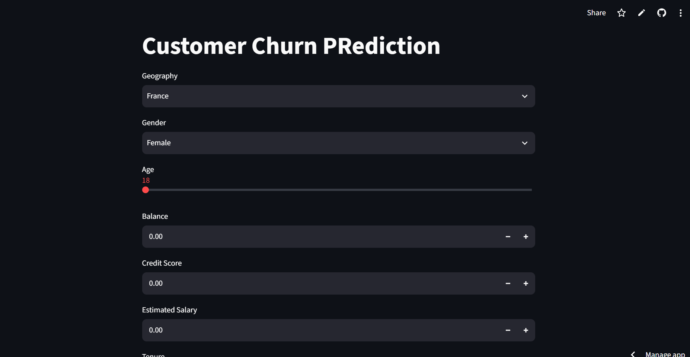

# 🧠 ANN Customer Churn Prediction using Deep Learning

<p align="center">
  
</p>

<p align="center">


</p>

---

# 🌐 Live Demo

🚀 **Try the application here**

**https://ann-customer-churn-prediction-gyydohsky45yid6klprlge.streamlit.app/**

---

# 📖 Overview

Customer churn is one of the biggest challenges faced by businesses, especially in the banking and telecom industries. Retaining existing customers is significantly more cost-effective than acquiring new ones.

This project builds an **Artificial Neural Network (ANN)** using **TensorFlow** and **Keras** to predict whether a customer is likely to leave a bank based on demographic and financial information.

The project covers the complete Deep Learning workflow including data preprocessing, categorical encoding, feature scaling, model training, evaluation, and deployment using **Streamlit** for real-time predictions.

---

# ⭐ Project Highlights

- 🧠 Artificial Neural Network (ANN)
- 🤖 TensorFlow & Keras
- 📊 Customer Churn Classification
- 🔄 Feature Encoding
- ⚖️ Data Scaling
- 🌐 Streamlit Web Application
- 💾 Model Serialization
- 📈 Real-Time Churn Prediction
- 🚀 Deployment Ready
- 📦 End-to-End Deep Learning Pipeline

---

# 🛠 Tech Stack

## Programming Language

- Python

## Deep Learning

- TensorFlow
- Keras

## Data Processing

- Pandas
- NumPy
- Scikit-Learn

## Deployment

- Streamlit

## Development Tools

- Git
- GitHub
- VS Code
- Jupyter Notebook

---

# 📂 Project Structure

```text
ANN-Customer-Churn-Prediction/
│
├── app.py
├── model.h5
├── scaler.pkl
├── label_encoder_gender.pkl
├── onehot_encoder_geo.pkl
├── Churn_Modelling.csv
├── experiments.ipynb
├── prediction.ipynb
├── requirements.txt
│
├── images/
│   ├── home.png
│   ├── prediction_form.png
│   └── prediction_result.png
│
└── README.md
```

---

# 🧠 ANN Architecture

```text
              Customer Dataset
                     │
                     ▼
          Data Preprocessing
                     │
                     ▼
        Label Encoding (Gender)
                     │
                     ▼
       One-Hot Encoding (Geography)
                     │
                     ▼
          Feature Scaling
                     │
                     ▼
        Artificial Neural Network
                     │
                     ▼
        Sigmoid Output Layer
                     │
                     ▼
       Churn Probability
                     │
                     ▼
    Streamlit Web Application
```

---

# 📊 Features Used

The model predicts customer churn using:

- Credit Score
- Geography
- Gender
- Age
- Tenure
- Account Balance
- Number of Products
- Has Credit Card
- Is Active Member
- Estimated Salary

### 🎯 Target Variable

- Exited (0 = No Churn, 1 = Customer Churn)

---

# 📸 Application Screenshots

## 🏠 Home Page

The landing page provides a simple and intuitive interface for entering customer details.

<p align="center">

</p>

---

## 📝 Customer Information Form

Users enter demographic and financial details that are processed by the trained ANN model.

<p align="center">

</p>

---

## 📈 Prediction Result

The application instantly predicts the probability of customer churn based on the provided information.

<p align="center">

</p>

---

# 🚀 Installation

Clone the repository

```bash
git clone https://github.com/Anujku007/ANN-Customer-Churn-Prediction.git
```

Move into the project directory

```bash
cd ANN-Customer-Churn-Prediction
```

Create a virtual environment

```bash
python -m venv venv
```

Activate the environment

### Windows

```bash
venv\Scripts\activate
```

### Linux / macOS

```bash
source venv/bin/activate
```

Install dependencies

```bash
pip install -r requirements.txt
```

Run the Streamlit application

```bash
streamlit run app.py
```

---

# 💻 Prediction Workflow

```text
Customer Details
        │
        ▼
Feature Encoding
        │
        ▼
Feature Scaling
        │
        ▼
Artificial Neural Network
        │
        ▼
Prediction Probability
        │
        ▼
Customer Churn Result
```

---

# 📊 Model Pipeline

```text
Dataset
   │
   ▼
Data Cleaning
   │
   ▼
Encoding
   │
   ▼
Scaling
   │
   ▼
ANN Model
   │
   ▼
Model Evaluation
   │
   ▼
Saved Model (.h5)
   │
   ▼
Streamlit Deployment
```

---

# 💡 Skills Demonstrated

- Deep Learning
- Artificial Neural Networks
- TensorFlow
- Keras
- Data Preprocessing
- Label Encoding
- One-Hot Encoding
- Feature Scaling
- Streamlit Deployment
- Model Serialization
- Software Engineering
- Machine Learning Deployment

---

# 📚 Key Learnings

This project helped me gain practical experience in:

- Designing Artificial Neural Networks
- Working with TensorFlow & Keras
- Preparing structured data for deep learning
- Feature encoding techniques
- Data scaling using StandardScaler
- Model serialization
- Deploying Deep Learning applications with Streamlit
- Building interactive prediction systems

---

# 🚀 Future Improvements

- Hyperparameter Tuning
- Dropout Regularization
- Batch Normalization
- Early Stopping
- Model Explainability (SHAP/LIME)
- Docker Support
- FastAPI REST API
- AWS Deployment
- CI/CD Pipeline

---

# 🤝 Contributing

Contributions are welcome!

1. Fork the repository.
2. Create a new feature branch.
3. Commit your changes.
4. Push to your branch.
5. Open a Pull Request.

---

# 👨‍💻 Author

**Anuj Yadav**

📧 Passionate about Machine Learning, Deep Learning, and AI.

**GitHub:** https://github.com/Anujku007

---

# ⭐ Support

If you found this project useful, consider giving it a **⭐ Star** on GitHub.

---

# 📜 License

This project is licensed under the **MIT License**.

---

<p align="center">
Made with ❤️ using TensorFlow, Keras and Streamlit
</p>